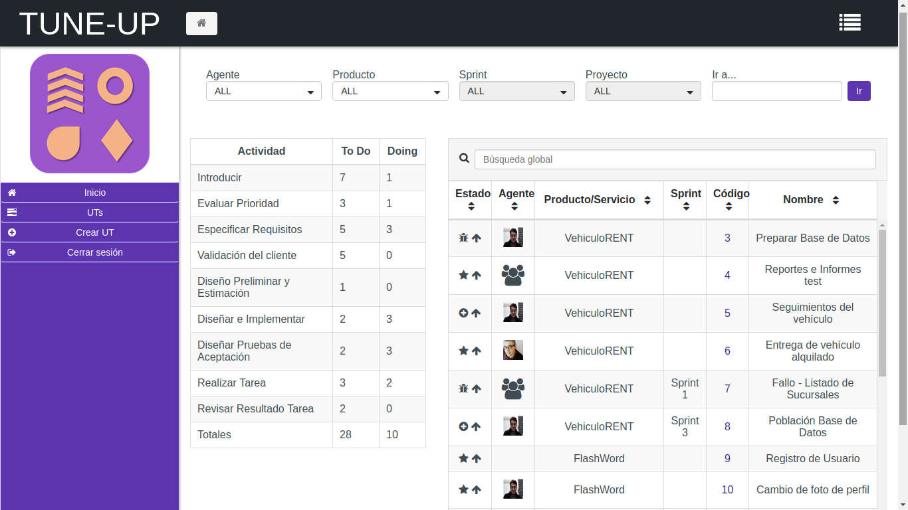
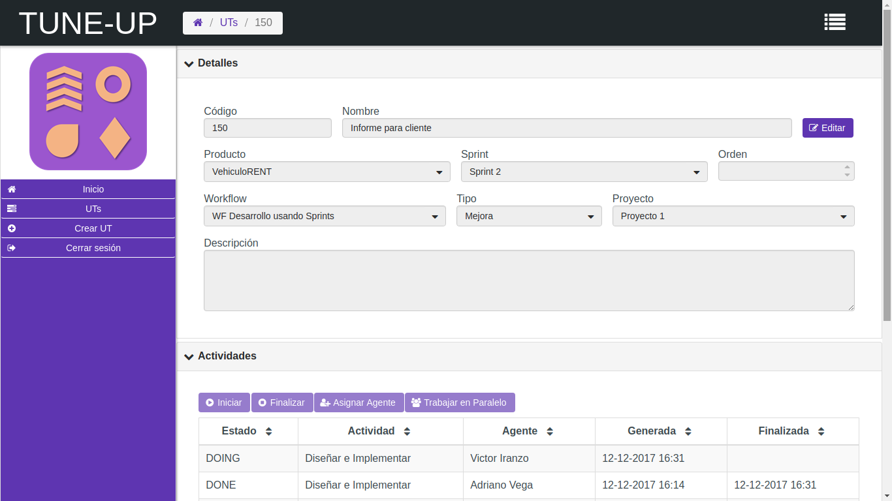
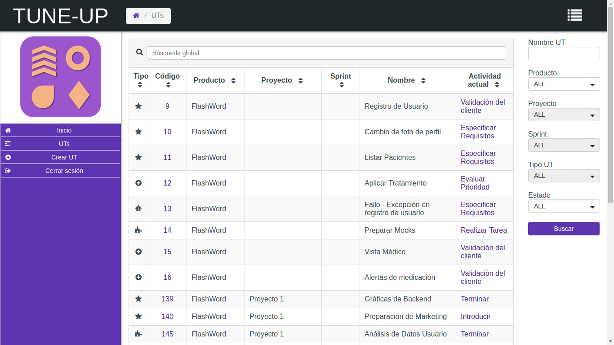

# TUNE-UP-Process-Web-Front
(Developed during the CS Degree) An Angular application using an existing API to administrate projects in an agile way.

# Introduction
The application has been developed using Angular 4 and components of PrimeNG. It is primarly divided in 3 modules:

- Login: as usual.
- Home: consisting in a Kanban view where different filters can be applied.
- UT: comes from Unit of Work. This view is divided in 2 parts: one with some details associated to the UT (its type, project, name, etc.) and a second part with the activies of the worfklow that the UT follows, where time tracking is done.

# Characteristics map
At the subject where the project was developed, a business idea was thought with the following characteristics:

- Kanban board.
- Monitoring of tasks for different roles (tester and programmer).
- Team Communication (Announcements, direct messages ...).
- Definition of Workflows.
- Product Management (requirements and characteristics of the product).
- Management of documentation.
- Backlog management (UTs prioritization).
- Record of time spent on a task.

# Some user interfaces

